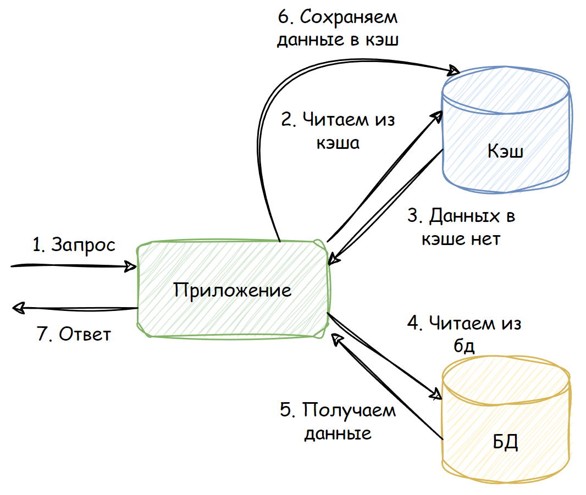
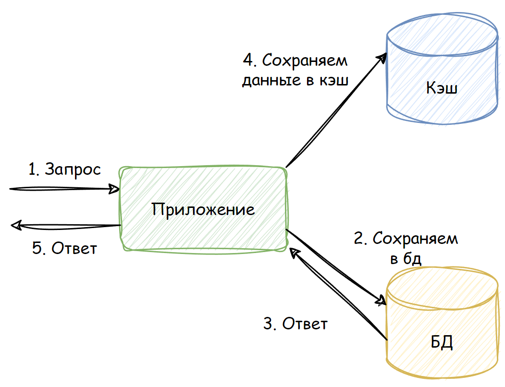

# Инструкция по запуску программы и использованию команд

## Запуск программы
1. Перейдите в директорию `homework/build/db` и выполните команду:
   ```bash
   make compose-up
   ```
2. Подождите, пока база данных поднимется.
3. Выполните миграции в директории `homework/build/db`:
   ```bash
   make goose-up
   ```
4. Перейдите в директорию `homework` и выполните команду:
   ```bash
   make
   ```

## Команды

### 1. Принять заказ
```bash
curl -u admin:password -X POST -H "Content-Type: application/json" \
-d '{"id": 22, "user_id": 21, "storage_duration": 3, "weight": 21.21, "cost": "42.00", "package": "box", "extra_package": "film"}' \
http://localhost:9000/orders/create
```

### 2. Выдать заказ
```bash
curl -u admin:password -X POST -H "Content-Type: application/json" \
-d '[21]' http://localhost:9000/orders/issue
```

### 3. Оформить возврат
```bash
curl -u admin:password -X POST \
"http://localhost:9000/orders/return?order_id=21&user_id=21"
```

### 4. Вернуть заказ курьеру
```bash
curl -u admin:password -X DELETE \
"http://localhost:9000/orders/withdraw?order_id=2"
```

### 5. Выдать заказы пользователя
Параметры: `user_id`, `limit`, `cursor_id`
```bash
curl -u admin:password \
"http://localhost:9000/orders/user?user_id=10&limit=10&cursor_id=0"
```

### 6. Выдать список возвратов
Параметры: `limit`, `offset`
```bash
curl -u admin:password \
"http://localhost:9000/orders/returns?limit=10&offset=0"
```

### 7. Посмотреть историю заказов
Параметры: `limit`, `offset`
```bash
curl -u admin:password \
"http://localhost:9000/orders?limit=10&offset=0"
```

### 8. Обновить задачу по ID
Параметры: `id`
```bash
curl -u admin:password -X POST \
"http://localhost:9000/tasks/reset?id=1"
```

## Взаимодействие с кэшем

### Чтение (Read aside)


### Запись (Write aside)
